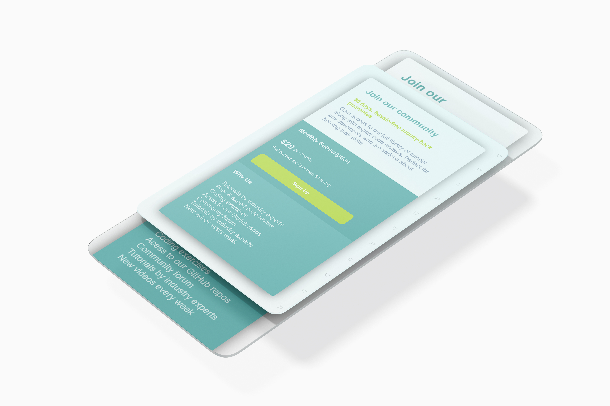

# Single price grid component - Solution
An Implementation of [Single price grid component challenge by Frontend Mentor](https://www.frontendmentor.io/challenges/testimonials-grid-section-Nnw6J7Un7).  The challenge was to develop the given single price grid component, ensuring optimal layout on different screen sizes. 

## Table of contents

- [Overview](#overview)
  - [The challenge](#the-challenge)
  - [Screenshot](#screenshot)
  - [Links](#links)
- [My process](#my-process)
  - [Built with](#built-with)
  - [What I learned](#what-i-learned)
  - [Useful resources](#useful-resources)
- [Author](#author)
- [Acknowledgments](#acknowledgments)

## Overview

### The challenge


- Develop the given Single price grid component. 

- Users should be able to view the optimal layout for the site depending on their device's screen size.

### Screenshot

- Design preview of the Single price grid component for desktop


- Design preview of the Single price grid component for Mobile




### Links

- Solution URL: [Click here](https://github.com/sayeedmunees/pricing-card-frontend-mentor-challenge)

- Live Site URL: [Click here](https://sayeedmunees.github.io/pricing-card-frontend-mentor-challenge/)

## My process

### Built with

- Semantic HTML5 markup
- CSS custom properties
- CSS Flexbox
- Desktop-first workflow

### What I learned

Throughout this project, I've gained valuable insights into developing responsive web layouts. One significant learning was the importance of utilizing Flexbox instead of relying on inline-block elements, which often led to various layout issues. Here's a snippet demonstrating the use of Flexbox for creating a responsive layout:

```css
#card {
  display: flex;
  flex-direction: column;
}

#price-container {
  display: flex;
  align-items: center;
}
```

### Useful resources

- [Frontend Mentor](https://www.frontendmentor.io/challenges/single-price-grid-component-5ce41129d0ff452fec5abbbc) - Got this challenge from Frontend Mentor,along with workfiles like required designs, icons and other files.

- [MDN Docs](https://developer.mozilla.org/en-US/) - Here's another useful resourse, which is the MDN documentation itself. It helped me to find, understand and use code snipped that i didn't knew before.


## Author

- GitHub - [@sayeedmunees](https://github.com/sayeedmunees)

## Acknowledgments

I'd like to extend a special thanks to Full Stack Zack, whose YouTube channel provided inspiration and valuable assistance throughout this project. His insights and tutorials were instrumental in guiding me towards success.